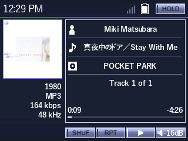
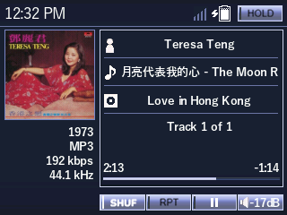
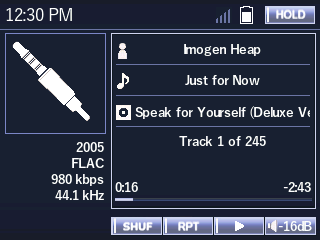
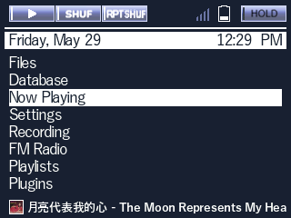
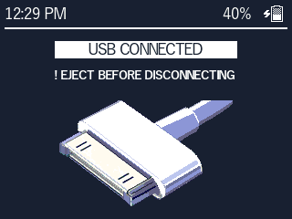

# entune_audio_ext_fonts

Version 1.0

Last Update: 05/29/2026

License: CC-BY-SA 3.0

By: Monica G.

Description: Theme based on the Entune Audio media system. The font used is the YuGothic font by JIYUKOBO. **THIS IS WHY THE FILE SIZE IS SO BIG** The font supports kanji, kana, mandarin and many other languages (see full list in config file). All pixel art is by me. All icons are made by me and/or updated from my previous themes. (minimal_RTC_sync and bunnyPod).

Code based on: minimal_RTC_sync and bunnyPod which were based on SNARTY by Simon Anden and BONES by Chuck Largo!

## fonts
- YuGothB
- YuGothM

## wps screenshots

## menu screenshot

## usb screenshot

